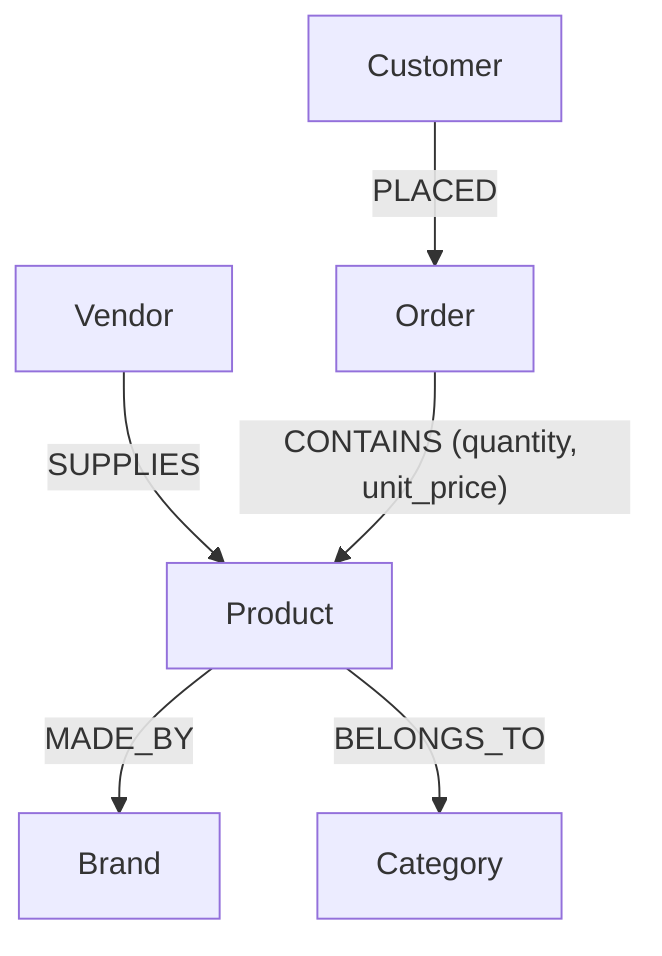

# E-Commerce Knowledge Graph Retrieval System

An LLM-powered retrieval system that answers natural language questions using a strict, grounded Knowledge Graph. 
The system translates user questions into structured JSON queries, executes them against a NetworkX graph, and synthesizes answers **only** from the retrieved data.

## Schema Architecture

The Knowledge Graph is built using NetworkX (`MultiDiGraph`) with the following entity relationships:



## Setup Instructions

**Prerequisites:** Python 3.9+

1. **Clone & Environment Setup:**
   ```bash
   git clone <repo-url>
   cd kg-ecommerce
   python -m venv venv
   
   # On Windows:
   .\venv\Scripts\activate
   # On Mac/Linux:
   source venv/bin/activate
   ```

2. **Install Dependencies:**
   ```bash
   pip install -r requirements.txt
   ```

3. **Configure the Environment:**
   Create a `.env` file in the root directory (you can use `.env.example` as a template):
   ```env
   GEMINI_API_KEY=your_actual_key_here
   GEMINI_MODEL_NAME=gemini-3.1-flash-lite
   ```

## Running the Application

**Start the API Server (FastAPI):**
This is the recommended way to interact with the graph programmatically.
```bash
uvicorn src.api:app --reload
```
Once running, you can:
- View the interactive Swagger UI at [http://127.0.0.1:8000/docs](http://127.0.0.1:8000/docs)
- Make a cURL request:
  ```bash
  curl -X POST "http://127.0.0.1:8000/query" \
       -H "Content-Type: application/json" \
       -d '{"question": "Which vendors supply Apple products?"}'
  ```
  **Response Example:**
  ```json
  {
    "success": true,
    "answer": "Based on the provided data, the vendors that supply Apple products are GlobalElectronics and TechDistributors.",
    "rows": [
      {"vendor_name": "GlobalElectronics"},
      {"vendor_name": "TechDistributors"}
    ]
  }
  ```

**Interactive Chatbot Mode:**
Run the `main.py` script to interact with the graph via the terminal.
```bash
python src/main.py
```

**Headless Single Question:**
```bash
python src/main.py --question "Show me the details for order O001"
```

**Run Automated Samples:**
This runs 6 pre-configured samples (including multi-hop and unanswerable edge-cases) and saves the results to `sample_results.md`.
```bash
python scripts/run_samples.py
```

## Running Tests

We use `pytest` to verify the deterministic graph queries and entity resolution (no LLMs are called during unit testing to ensure fast and reliable execution).
```bash
# On Windows:
.\venv\Scripts\pytest tests/

# On Linux/macOS:
pytest tests/
```

## Grounding Mechanism (How it prevents hallucinations)

This pipeline enforces strict adherence to truth by decoupling the **Planner** and the **Synthesizer**:

1. **Query Planning (LLM #1):** The LLM translates natural language into a JSON payload calling a whitelisted function (e.g., `products_by_brand_and_vendor`). It has NO access to the raw data yet.
2. **Deterministic Execution:** The Python pipeline fuzzy-matches parameters to real node IDs, validates the request, and executes a plain NetworkX graph traversal.
3. **Synthesis (LLM #2):** A second LLM receives *only* the retrieved rows and the original question. Its system prompt strictly restricts it to answering from the provided context.
4. **Hard Fallback:** If the NetworkX execution returns zero rows, the pipeline intercepts it and immediately returns *"No matching data found in the knowledge graph."* LLM #2 is skipped entirely, guaranteeing zero hallucination.
